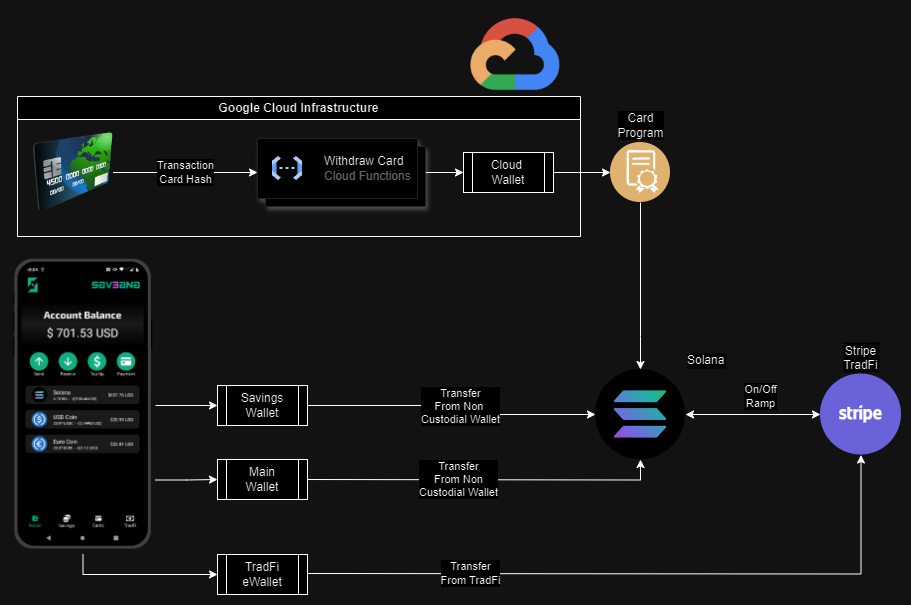
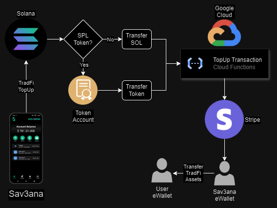

# Sav3ana
 
Sav3ana: Batch transactions, smart savings, easy card payments and On/Off Ramp.

## Fast Links:

WALLET CODE: [CODE](./Sav3ana/)

PLAYSTORE LINK: [LINK](https://play.google.com/store/apps/details?id=com.altaga.sav3ana)

VIDEODEMO: [VIDEO](pending...)

# System Diagram:

- Main Account: Within the schematics you can see that we have our main wallet, which is a Non Custodial Wallet, to which you will have to save its mnemonic at the time of its creation.

- Savings Account: This wallet, like the previous one, is a Non Custodial Wallet, which will save the savings on each transaction according to the chosen savings protocol.

- Card Account: Esta wallet esta basada en una PDA Account controlada por un Program, esto con el fin de usarse como una "Smart Contract Wallet". Mas detalles en la seccion [Card Payments](#card-payments)

- Batch Transactions: Through Solana network, it is possible to carry out several batch transactions using a single signature, this allows us all the incredible functionalities of our wallet.

- Stripe: Mediante los servicios financieros de Stripe podemos realizar On/Off ramp directamente desde nuestra wallet con un simple click. Mas detalles en [On/Off Ramp](#onoff-ramp)

- Google Cloud: todos los servicios como Stripe estan configurados en la nube de google cloud debido a las credenciales privadas que estos servicios utilizan.

- Vybe: con el fin de obtener informacion rapida y fiel de la chain optamos por utilizar Vybe Netowork API.

# Features:

Nuestra aplicacion como lo hemos mencionado anteriormente tiene como fin aumentar la adopcion de crypto, mejorar la salud financiera de los usuarios y darles mas acceso a servicios sin todas las asperezas de los bancos tradicionales.[1](#references)

## Batch Transactions:

Solana siempre ha tenido la capacidad de realizar multiples transacciones con una sola firma, sin embargo nosotros decidimos implementar una forma de realizar este tipo de transacciones directamente desde nuestra UI, con el fin de poder hacer todo tipo de transferencias multiples mediante una transaccion unica.[2](#references)

### Screen:

Para hacer uso de esta feature deberas entrar al boton de Send, este mostrara las una form que deberemos llenar con todas las transacciones que desees.

  

Una vez estan listas todas las transacciones, procederemos a presionar el boton de Check, esto ejcutara una simulacion de la transaccion y mostrara los detalles de la transaccion y si todo es correcto podremos ejecutarla con el boton Execute. Y unos milisegundos despues veremos la confirmacion y un enlace al explorer.

  

Todo el proceso de realizar una trasaccion unica se realiza mediante el siguiente codigo.

- [SEND CODE](./Sav3ana/src/screens/sendWallet/sendWallet.js)
- [MODAL CODE](./Sav3ana/src/utils/transactionsModal.js)

## Smart Savings:

Una de las misiones de nuestra aplicacion es incentivar el ahorro constante, esto normalmente se realiza mediante educacion financiera y buenos habitos de consumo. Sin embargo nosotros vamos un paso mas alla, realizamos pequeños ahorros en cada compra y transaccion que haga el usuario.

La cuenta de savings tiene un par de funciones personalizables.

- Activate Savings: Este switch permite encender y apagar la cuenta de ahorro, con el fin de que usuario pueda parar de adjuntar las transacciones de ahorro en cada compra.
  
- Savings Period: Este menu desplegable le da al usuario fijar una meta de ahorro, ya sea diario, semanal, mensual o anual. NOTE: Por ahora es posible cambiarlo sin limitaciones, pero queremos que el usuario no pueda quitar la fecha fija de su ahorro hasta que se cumpla el plazo.

- Savings Protocol: Este menu desplegable nos da dos opciones, ahorro porcentual, que tomara el porcentaje que configuremos en cada compra o los smart savings, este protocolo lo explicaremos mas adelante. [HERE](#savings-protocols)

### Screen:

El ahorro que realiza la savings wallet por el momento es basado en SOL, pero en el futuro vamos a incluir stablecoins como USDC.

  

All technical implementations for this tab are included here.
- [TAB CODE](./Sav3ana/src/screens/main/tabs/tab2.js)

### Savings Protocol:

- Balanced Protocol, this protocol performs a weighted rounding according to the amount to be paid in the transaction, so that the larger the transaction, the greater the savings, in order not to affect the user. And this is the function code:

        export function balancedSavingToken(number, usd1, usd2) {
            const balance = number * usd1;
            let amount = 0;
            if (balance <= 1) {
                amount = 1;
            } else if (balance > 1 && balance <= 10) {
                amount = Math.ceil(balance);
            } else if (balance > 10 && balance <= 100) {
                const intBalance = parseInt(balance, 10);
                const value = parseInt(Math.round(intBalance).toString().slice(-2), 10);
                let unit = parseInt(Math.round(intBalance).toString().slice(-1), 10);
                let decimal = parseInt(Math.round(intBalance).toString().slice(-2, -1), 10);
                if (unit < 5) {
                unit = '5';
                decimal = decimal.toString();
                } else {
                unit = '0';
                decimal = (decimal + 1).toString();
                }
                amount = intBalance - value + parseInt(decimal + unit, 10);
            } else if (balance > 100) {
                const intBalance = parseInt(Math.floor(balance / 10), 10);
                amount = (intBalance + 1) * 10;
            }
            return new Decimal(amount).sub(new Decimal(balance)).div(usd2).toNumber();
        }

- Percentage protocol, unlike the previous protocol, this one aims to always save a percentage selected in the UI.

        export function percentageSaving(number, percentage) {
            return number * (percentage / 100);
        }

All technical implementations for this protocols are included here.
- [PROTOCOLS CODE](./Sav3ana/src/utils/utils.js)

## Card Payments:

Parte de la adopcion de crypto al dia a dia de la gente es poder utilizarlo al igual que usan su celular o tarjeta para realizar pagos, pero sin descuidar la seguridad y decentralizacion de crypto.[3](#references)

### Contactless Payment:

Las tarjetas de pagos no son solo un chip NFC tradicional, de echo estan mas asememejados a pequeñas computradoras con programas instalados, los cuales se ejecutan en milisegunos al momento que se esta escaneando el chip [4](#references).

Asi que implementamos esta lectura de tarjeta para poder leer los datos sensibles de ls tarjetas de pagos y con esto poder generarles una tarjeta virtual que pudiera usarse para pagos crypto.

All technical implementations for this feature are included here.
- [READ CARD CODE](./Sav3ana/src/screens/main/components/readCard.js)

### Virtual Card:

Sin embargo, surge un desafío adicional: ¿cómo garantizamos que las tarjetas virtuales y los fondos que contienen mantengan la descentralización, asegurando que los activos sigan siendo propiedad del usuario? Es importante recordar que los pagos con tarjeta no implicarán la intervención directa de la wallet.

Este problema no se puede resolver con una EOA Wallet en modalidad de Custodial Wallet, ya que las claves privadas no estarían bajo el control del usuario. La solución consiste en desarrollar un programa que genere "Virtual Cards" utilizando PDA's (Program Derived Addresses), lo que permite mantener la descentralización y el control del usuario sobre sus activos.

All technical implementations for this program are included here.
- [PROGRAM CODE](./Programs/src/lib.rs)
- [TAB CODE](./Sav3ana/src/screens/main/tabs/tab3.js)

### Program:

El programa tiene 4 funciones fundamentales, el codigo esta perfectamente comentado, si quieres profundizar en su funcionamiento porfavor mira el codigo que hemos compartido en el repositorio.

- Create Card: Esta funcion genera una PDA con los datos que le proporcionemos, la PDA al poder almacenar informacion, nosotros le agregamos informacion publica que nos permita mejorar la funcionalidad.
  -   owner: [u8; 32], // Card Owner
  -   nfc: bool,   // Activate or Deactivate
  -   types: bool, // Physical or Virtual
  -   kind: u8,    // 0 = Debit, 1= Credit, 2=Prepaid, etc
  -   brand: u8,   // 0 = VISA, 1 = MASTERCARD, 2 = AMEX, etc

- ChangeInfo: Si fuera necesario es posible realizar cambios en la metadata de la tarjeta, por ejemplo para activar o desactivar los pagos contactless.

- Purchase: Mediante esta funcion se realizan los pagos con SOL, esto lo hace con una transferencia simple.

- PurchaseToken: Por ultimo esta funcion nos permite realizar pagos con SPL token, esto lo hace medinate CPI (cross program invocation), ya que necesitamos que la PDA firme la transferencia de tokens de los que es propietaria.

All technical implementations for this program are included here.

- [PROGRAM CODE](./Programs/src/lib.rs)
- [CLIENT TEST CODE](./Programs/client/)

### Screen:

Todo esto en conjunto lo desplegamos en una UI sencilla donde el usuario puede recargar como una tarjeta prepago su tajeta virutal, la cual esta ligada como dijimos con su tarjeta fisica.

  

All technical implementations for this tab are included here.

- [TAB CODE](./Sav3ana/src/screens/main/tabs/tab3.js)

## On/Off Ramp:

Los servicios de TradFi los realizamos mediante las API de Stripe. Los cuales nos permiten tener las siguientes features en la app.

- eWallet: Al momento de tener los servicios de Stripe activos podemos crear eWallets donde los usuarios puedan tener su dinero TradFi.
- Currencies: Segun la jurisdiccion del usuario podra tener su propia moneda en la aplicacion, por el momento solo somos compatibles con USD (US Dollar), EUR (Euro) y MXN (Mexican Peso).

### On Ramp:

El servicio de On Ramp es completamente controlado desde Google Cloud, ya que no se requiere ninguna firma del usuario para realizar una transferencia desde Stripe a la cuenta de la empresa, asi como en la misma cloud realizamos la transaccion en la red de solana para transferirle el token deseado al usuario.

### Off Ramp:

El servicio de Off Ramp es un poco diferente, ya que requiere realizar primero la transferencia en crytpto desde la cuenta del usuario, asi que el diagrama de transferencia es el siguiente, aunque comparte mucha simulitud con el anterior.

 
### Screen:

Esta interfaz nos permite gestionar nuestro dinero TradFi y a su vez poder hacer On/Off ramp de nuestros assets entre si con un solo clic.

  

All technical implementations for this tab are included here.

- [TAB CODE](./Sav3ana/src/screens/main/tabs/tab4.js)
- [CLOUD TOPUP](./Cloud/TopUp/index.js)

## Vybe Network:

Se utilizo la siguiente API de Vybe Network con el fin de mejorar la UI de nuestra aplicacion asi como obtener datos de forma mas fiable y sencilla.

- Token Balance: Debido a que tenemos que estar monitorizando los balances simultaneamente de 3 cuentas que estan ligadas a nuestra app, ademas de ver el balance de multiples tokens, se decidio utilizar esta API.

        fetch(
            `https://api.vybenetwork.xyz/account/token-balance/${publicKey}`,
            requestOptions,
        )
            .then(response => response.json())
            .then(async result => {
                const balancesTemp = [
                result.data.find(object => object["SOL"] === value).amount,
                result.data.find(object => object["USDC"] === value).amount,
                result.data.find(object => object["EUR"] === value).amount
            ];
            ...
            })

All technical implementations for this tab are included here.

- [VYBE CODE](https://github.com/altaga/Sav3ana/blob/vybe/Sav3ana/src/screens/main/tabs/tab1.js)

# References:

1. https://www.21shares.com/en-eu/research/monthly-review-jan-24
2. https://solana.com/docs/core/transactions
3. https://solana.com/developers/defi
4. https://medium.com/@androidcrypto/talk-to-your-credit-card-android-nfc-java-d782ff19fc4a
5. https://www.nerdwallet.com/article/small-business/what-is-stripe
